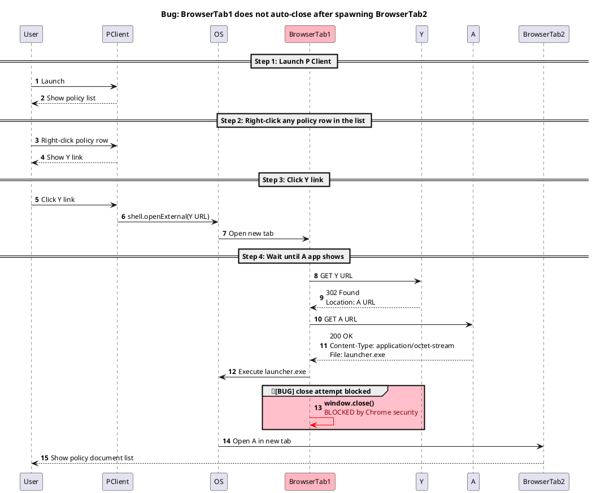

# Bug Investigation Framework

## 4 Phases: What → How → Where → Why

```
1. INTAKE      → What?   Bug là gì?
2. REPRODUCE   → How?    Xảy ra thế nào?
3. SCOPE       → Where?  Xảy ra ở đâu?
4. RCA         → Why?    Tại sao?
```

---

## Phase 1: Intake

**Goal:** Thu thập đủ thông tin để bắt đầu reproduce.

**Question:** Tôi cần biết gì để thử reproduce?

**Exit:** Có repro hint (steps/env/user) + ghi lại trong investigation note.

---

## Phase 2: Reproduce

**Goal:** Tự tái hiện bug ít nhất 1 lần, trên 1 path.

**Question:** Tôi có thể tự gây ra bug này không?

**Exit:** Bug reproduce được + sequence diagram.

<details>
<summary><b>Example artifact</b> — sequence diagram capture từ repro path</summary>

> Bug: BrowserTab1 không tự đóng sau khi spawn BrowserTab2



</details>

---

## Phase 3: Scope

**Goal:** Xác định path nào bug, path nào không.

**Question:** Tôi đã thử hết các path liên quan chưa?

- Còn cách nào khác trigger hành động này?
- Mỗi path đi qua component nào?
- Path share gì, khác gì?

**Exit:** Biết tập path bug vs path OK + scope table.

---

## Phase 4: RCA

**Goal:** Xác định nguyên nhân gốc giải thích đúng scope đã tìm.

**Question:** Tôi giải thích được tại sao bug chỉ xảy ra ở scope đó không?

**Exit:** Có statement "bug xảy ra vì X" + evidence (code ref / log / diff).

---

## Iteration Loops

Không tuần tự cứng. Có thể loop ngược:

- Phase N không reproduce được → quay lại Phase N-1

---

## Anti-patterns

❌ **Skip Reproduce** → phân tích trên không khí

❌ **One-shot Scope** → scope sai vì thiếu data

❌ **Skip RCA, nhảy thẳng sang fix** → fix triệu chứng, bug tái xuất hiện

❌ **Cố scope hoàn chỉnh ngay từ đầu** → scope dựa trên giả định

---

## Boundary

Framework dừng ở RCA. **Không** bao gồm fix design, implementation, testing, deployment — đó là engineering process khác.

> Output cuối: *"Bug X xảy ra vì root cause Y, ảnh hưởng scope Z"* → handover cho engineering.

---

## Prompts (Claude Code)

Workflow vẽ sequence diagram cho Phase 2:

```
[Note]                  → Prompt 1 → Diagram v1 (nhiều TODO)
[Diagram + Source A]    → Prompt 2 → Diagram v2 (TODO ↓, có cite code)
[Diagram + Source B]    → Prompt 2 → Diagram v3 (TODO ↓ nữa)
[Diagram + DevTools]    → Manual   → Diagram final (no TODO)
```

<details>
<summary><b>Prompt 1</b> — Build sequence diagram từ repro note</summary>

````markdown
Build PlantUML sequence diagram cho repro note dưới đây.

# Pattern
Match example artifact ở `docs/framework/bug-investigation.md` (Phase 2) **chính xác**. PlantUML có nhiều syntax tương đương (vd `->` vs `->>`, `participant` vs `actor`) — chỉ dùng cách example dùng.

# Rules
1. **Evidence first.** Mỗi message/actor/title cần 1 trong:
   - **Note có verb cho action** (vd "click", "launch", "shows") → vẽ thẳng, no marker. Message wording PHẢI lấy literal từ note (verb + entity của note đó). KHÔNG import specifics từ example pattern (vd "policy document list") khi note đã cho evidence. Entity-only mention (vd "the list", "B link") KHÔNG đủ — phải có verb cho action mới tính evidence.
   - **Pattern trong example** (kể cả values cụ thể: status code, URL, file name) → infer, suffix ` 🤖` ở cuối message. 🤖 chính là disclaimer cho values guess — đừng ngại infer cụ thể.
   - **Không có cả 2** → `<TODO: capture from <tool>>` với tool **match message type**:
     - Network HTTP → DevTools Network
     - OS call (file/process/IPC) → Process Monitor
     - UI render → Screen Recording
2. **Bug marker** chỉ thêm khi note nói expected ≠ actual.
3. **Step `==`** copy nguyên văn từ note.
4. **Title**: `Bug: <desc>` nếu note nói bug, else `Repro: <summary inferred từ steps>` suffix ` 🤖`.
5. **Direction/layering**: sender/receiver của message phải follow layering pattern đã establish ở earlier steps. KHÔNG skip layers — vd earlier steps đi qua `BrowserTab2` để render F app → action sau đó từ User cũng phải qua `BrowserTab2`, không User → F trực tiếp.

# Output
- 1 block PlantUML chạy được

# Note

```
[YOUR REPRO NOTE HERE]
```
````

</details>

<details>
<summary><b>Prompt 2</b> — Fill TODO từ source code của 1 actor</summary>

````markdown
Fill các `<TODO>` trong PlantUML diagram bằng source code của 1 actor.

# Inputs
- **Diagram**: [paste hoặc path]
- **Source**: [path]
- **Actor**: [participant name, vd PClient]

# Logic
Đọc source, tìm call/handler của actor. Với mỗi TODO liên quan:
- Code cover → thay bằng message thật + cite `[code: file:line]`
- Code có call nhưng response do runtime → giữ TODO, narrow tool
- Code không cover → giữ nguyên

# Rules
1. **Code ≠ runtime.** `fetch(URL)` không nói status reply. Status/body chỉ confirm bằng runtime capture.
2. **Branches**: chọn nhánh khớp repro. Ambiguous → annotate `<AMBIGUOUS: A vs B, cần <tool>>`.
3. **Cite `file:line`** cho mọi message từ code.

# Output
- Diagram với cite
- Changelog: TODO nào fill từ đâu
- Tóm tắt: TODO còn lại nhóm theo tool
````

</details>