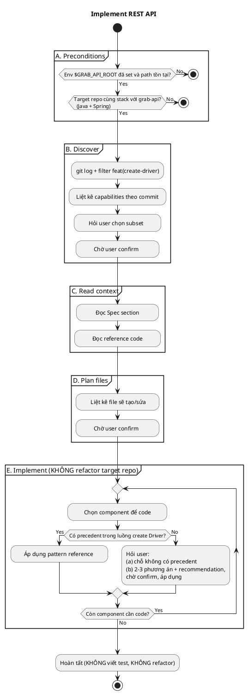

# Task
Implement endpoint **Create Order** theo pattern của **create Driver**
trong reference repo `grab-api`. Chỉ implement, không viết test.

# Reference

Repo: `grab-api`, path từ env `$GRAB_API_ROOT`.
Entry point: `$GRAB_API_ROOT/src/main/java/com/grab/api/controller/api/DriverApi.java`.

Mọi command đọc reference (`git log`, đọc file) chạy trên
`$GRAB_API_ROOT`, không phải target repo.

# Workflow

Agent BẮT BUỘC thực hiện theo flow dưới đây:

- Mỗi `:action;` là 1 step rời rạc, không skip, không combine, không
  đổi thứ tự.
- Mỗi `Chờ user confirm` là HARD STOP — không tự đi tiếp khi chưa có
  reply từ user.
- **Bất cứ lúc nào có concern** (mơ hồ, không chắc, thiếu info, edge
  case không có trong diagram, lệch khỏi reference dù chỉ chút) →
  STOP và hỏi user theo format `(a) concern là gì (b) 2-3 phương án
  + recommendation`. KHÔNG tự đoán, KHÔNG "best practice", KHÔNG
  "có lẽ".



# Spec

## API contract
- Method + path: POST /api/orders
- Content-Type: application/json
- Response: 201 + JSON body (shape ở dưới)
- Auth: không

## Fields & validation

### Request body
```json
{
  "customerId": "string",
  "merchantId": "string",
  "deliveryLocation": {
    "latitude": 10.762622,
    "longitude": 106.660172
  },
  "items": [
    {
      "productId": "string",
      "quantity": 1,
      "unitPrice": "12.50"
    }
  ],
  "note": "string"
}
```

| Field                       | Type     | Required | Constraint                  |
|-----------------------------|----------|----------|-----------------------------|
| customerId                  | string   | yes      | non-blank                   |
| merchantId                  | string   | yes      | non-blank                   |
| deliveryLocation.latitude   | number   | yes      | -90 ≤ x ≤ 90                |
| deliveryLocation.longitude  | number   | yes      | -180 ≤ x ≤ 180              |
| items                       | array    | yes      | min 1 phần tử               |
| items[].productId           | string   | yes      | non-blank                   |
| items[].quantity            | integer  | yes      | 1 ≤ x ≤ 99                  |
| items[].unitPrice           | string   | yes      | decimal, ≥ 0 [?]            |
| note                        | string   | no       | max 500 chars               |

### Response body (201)
```json
{
  "id": "string",
  "customerId": "string",
  "merchantId": "string",
  "deliveryLocation": { "latitude": 0, "longitude": 0 },
  "items": [
    { "productId": "string", "quantity": 1, "unitPrice": "12.50" }
  ],
  "totalPrice": "25.00",
  "status": "PENDING",
  "note": "string",
  "createdAt": "2026-05-16T10:30:00Z"
}
```

| Field        | Type   | Note                                  |
|--------------|--------|---------------------------------------|
| id           | string | server-generated                      |
| totalPrice   | string | server-calculated, decimal            |
| status       | string | enum: PENDING / ... [? — list states] |
| createdAt    | string | ISO-8601 UTC                          |

## Business rules
- customerId phải tồn tại → không thì 409
- merchantId phải tồn tại và đang active → 409
- totalPrice tính server-side từ items[].quantity × items[].unitPrice,
  không tin client
- Side effect: không

## Error cases
- 400: validation fail
- 404: customerId hoặc merchantId không tồn tại
- 409: merchant không active / không nhận order [?]
